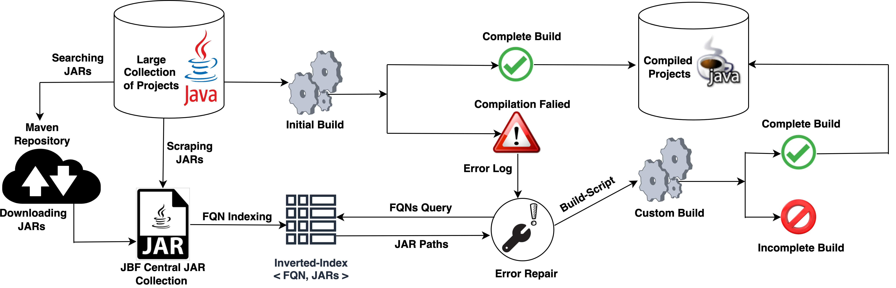

# SourcererJBF:  A Java Build Framework For Large Scale Compilation
SourcererJBF or JBF is a build framework that is capable of building thousand of Java projects at scale.
JBF first takes a vast collection of Java projects as input and scrapes all the required external dependencies from those projects
or the web. Then it indexes these dependencies and compiles the projects in multiple stages. During the compilation, JBF fixes errors
and resolves external dependencies.



### Installation

Java version: jdk8+
Ant version: any that uses javac from jdk8+


JBF is fully developed in Python and the following python packages are required to execute JBF: 
- subprocess32, 
- chardet 
- simplejson

#### Installation
```
pip install subprocess32
pip install chardet
pip install simplejson
```


### How To Run JBF


* ##### Edit The Configuration File

``` pycon
[DEFAULT]
# The directory under which all the java projects to be compiled exist.
root = /Users/mrhmisu/previous-pc/ubuntu/projects
# Rebuild the projects from scratch. Dependency rematching implies 
# that all projects might not recompile successfully.
rebuild_from_scratch = True
# The file with project paths to be build. Paths in file are considered relative to the root directory.
file = AUTOGEN
# The directory under which all the output build directories will be put.
outfolder = /Users/mrhmisu/previous-pc/ubuntu/builds/
# An output file that will contain all the output information consolidated.
output = /Users/mrhmisu/previous-pc/ubuntu/builds/project_details.json
# The root of the java repository
jars =/Users/mrhmisu/previous-pc/ubuntu/jars
# The file that represents the mapping of fqn to jar in repository.
fqn_to_jar = /Users/mrhmisu/previous-pc/ubuntu/builds/fqn-to-jars.shelve
# The number of base threads to be run.
threads = 1
try_project_build = False
verbose = True
only_project_build = False
```

* ##### Command To Execute JBF
```bash
python3 compile.py
```

* #### Generated Files and Directories
projects/ All the projects that can be build. There are at most 1000 projects in each folder in projects/
builds/ All the generated bytecodes and complete information about the latest build
project_details.json Bookkeeping details for the projects that instruct the compilation script on how to build them successfully. This file has been generated from the previous successful run.
jars/ The repository of jars needed for these projects.
/ext -> our own copy of java extention jars, and any other special jars
sourcererjbf/The python package with scripts for building the projects.
xml-templates/The templates of the build.xml, and ivy.xml files used when building the projects.
fqn-to-jars.json/The global mapping of FQNs to jars, from our huge repository
compile.py/ The main driver script for building projects.
builds/ The output of the build process. Each project build data is placed here in a heirarchy that is similar to that of projects/
TBUILD/ Temporary build folders for all threads. (ignore)
Uncompress/Temporary folder used to unzip the project files from their zip archives. (ignore)
hs_*.log/ Log files generated by worker threads in case of failures.(ignore)

NOTE: please delete all these generated files & folders before each new run of compile.py.
```bash
./clean-up.sh
```
