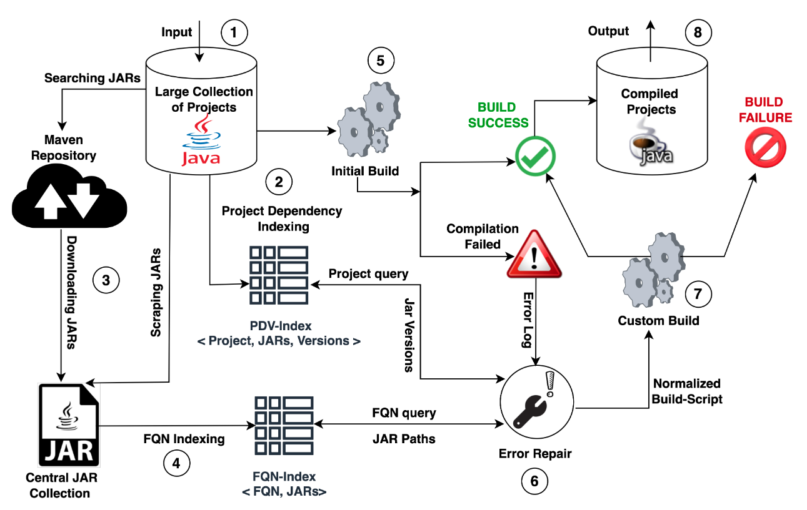

# SourcererJBF:  A Java Build Framework For Large Scale Compilation

SourcererJBF or JBF is a build framework that is capable of building thousand of Java projects at scale.
JBF first takes a vast collection of Java projects as input and scrapes all the required external dependencies from
those projects or the web. Then it indexes these dependencies and compiles the projects in multiple stages. During the
compilation, JBF fixes errors and resolves external dependencies. With JBF, we successfully compiled [91,076 Java projects](https://jbf-with-jgigantic.web.app/jgigantic.html) from a collection of 299,142 projects downloaded from GitHubs. All the artifacts of JBF is provided [here](https://jbf-with-jgigantic.web.app/).



## JBF Featuers
1. **Scalable:**  JBF is a scalable build framework that can build thousands of projects at a scale. In our experiment, we executed JBF on a collection of 299,142 Java projects downloaded from GitHub. JBF attempted to compile all of these projects and built [91,076 projects (30.44\%) successfully](https://jbf-with-jgigantic.web.app/jgigantic.html), which substantiates JBF's scalability.

2. **Accurate:** The JBF-generated build result is as accurate as the project's existing build system compiled output. In our experiment, we determined in total 24,526 projects built by both JBF and the project's own build script with the numbers of Maven (18,852), Gradle(2,047), and Ant (3,357) projects, respectively. We compared the JBF-produced output (class files checksum value) with the project's built-system output for all these projects. We examined that JBF got 100\% build accuracy with the same number of class files and the exact checksum values.  

3. **Configurable:** JBF is fully configurable for different types of usage patterns. For instance, researchers can configure JBF to run  *(i) Only JBF build*, *(ii) Only project own build script*, *(iii) Try own project build first, then try JBF*. In addition to that, researchers can specify the number of threads for enabling multiple processing, load preconstructed FQN index, and set the desired output format and locations.

4. **Controlled Build:** JBF's one of the core features is its predictable behaviors and user-controlled. JBF stores the output of the project compilation (both *Complete* and *Incomplete Build*) in a predefined structure and location. Researchers can control the environment and have the output in a specific destination without paying the effort of exploring different types of project-specific output folders and artifacts.

5. **Normalized Build:** JBF produced a normalized built script for each successfully compiled project containing class files( bytecode) and packaged all required dependencies to recompile the project. The motivation behind the normalized build scripts is that the build script structure and type remain the same in all compiled projects. Researchers do not need project-specific knowledge to treat each project individually, and they can automate the execution of the normalized build script to recompile all projects.


## Environment Setup & Requirements

- Java Version: JDK-8+ [Preferable Latest Java [OpenJDK17](https://openjdk.java.net/projects/jdk/17/)]
- Ant Version: Ant 1.10 works with ``javac`` from JDK-8+ [Ant](https://ant.apache.org/manual/install.html)
- Python Version: 3.9+
- JBF uses three python packages [subprocess32](https://pypi.org/project/subprocess32/), [chardet](https://pypi.org/project/chardet/) and [simplejson](https://pypi.org/project/simplejson/). The following python packages are
  required to install before running JBF:

```
pip install subprocess32
pip install chardet
pip install simplejson
```

## Directories and Files Structure

```
📦 SourcererJBF
   ┃ 📂 doc                           // Resource for project documentation
   ┃ 📂 env-test                     // Resource for test the JBF workflow
   ┣ 📂 sourcererjbf                // The python package with scripts for building the projects
   ┃ 📂 utils                      // The utlity package with scripts for analyzing Jars and projects
   ┃ 📂 xml-templates             // The templates for creating normalized build scripts
   📜 clean-up.sh                // Script for cleaning all generated files & folders       
   📜 jbf.config                // Contains the configuration of JBF execution
   📜 jbf-cmd-compile.py       // Main Entry point of JBF execution with Command Line Arguments
   📜 jbf-config-compile.py   // Main Entry point of JBF execution with jbf.config
   📜 README.md              // JBF documentation
```

## Executing JBF
JBF can be run with a configuration file or with the command line arguments

- #### Run JBF With Configuration File
The easiest option is to edit the ``jbf.config`` configuration file and execute the ``jbf-config-compile.py`` script.
The file is self-explanatory, and it just requires to update according to host machine physical paths.

- #### ``jbf.config``
``` yml
[DEFAULT]
# The directory under which all the java projects to be compiled exist.
root =./env-test/projects
# Rebuild the projects from scratch. Dependency rematching implies that all projects might not recompile successfully.
rebuild_from_scratch = True
# The file with project paths to be build. Paths in file are considered relative to the root directory.
file = AUTOGEN
# The directory under which all the output build directories will be put.
outfolder = ./env-test/builds/
# An output file that will contain all the output information consolidated.
output = ./env-test/project_details.json
# The root of the jar collection repository
jars =./env-test/jars
# The file that represents the mapping of fqn to jar in repository.
fqn_to_jar = ./env-test/fqn-to-jars.shelve
# The number of base threads to be run.
threads = 1
try_project_build = False
verbose = True
only_project_build = False
```

```bash 
python3 jbf-config-compile.py
```
- #### Run JBF With Command Line Arguments
If you prefer to run JBF with command line arguments, you can get the details of these arguments with help option.
```bash
python3 jbf-cmd-compile.py -h
```
```bash
usage: jbf-cmd-compile.py [-h] [-r ROOT] [-b] [-f FILE] [-d OUTFOLDER] [-o OUTPUT] [-j JARS] [-ftj FQN_TO_JAR] [-t THREADS] [-tpb] [-v] [-opb]

optional arguments:
  -h, --help            show this help message and exit
  -r ROOT, --root ROOT  The directory under which all the java projects to be compiled exist.
  -b, --rebuild_from_scratch
                        Rebuild the projects from scratch. Dependency rematching implies that all projects might not recompile successfully.
  -f FILE, --file FILE  The file with project paths to be build. Paths in file are considered relative to the root directory.
  -d OUTFOLDER, --outfolder OUTFOLDER
                        The directory under which all the output build directories will be put.
  -o OUTPUT, --output OUTPUT
                        An output file that will contain all the output information consolidated.
  -j JARS, --jars JARS  The root of the java repository
  -ftj FQN_TO_JAR, --fqn_to_jar FQN_TO_JAR
                        The file that represents the mapping of fqn to jar in repository.
  -t THREADS, --threads THREADS
                        The number of base threads to be run.
  -tpb, --try_project_build
                        Use project build files first if it exists.
  -v, --verbose         Forces javac output to be verbose. Default False
  -opb, --only_project_build
                        Only use project build files.
```

```bash
python3 jbf-cmd-compile.py [-h] [-r ROOT] [-b] [-f FILE] [-d OUTFOLDER] [-o OUTPUT]
[-j JARS] [-ftj FQN_TO_JAR] [-t THREADS]
```

## The Test Environment and JBF Generated Directories, Files 
```
📦 SourcererJBF
  ┣ 📂 env-test                       // Resource for test the JBF workflow
      ┣ 📂 projects                          // All the projects that can be build. There are at most 1000 projects in each folder in projects
      ┣ 📂 jars                             // Collection of jars representing external dependencies of the porjects
      ┣ 📂 builds                          // The output of the build process. Generated following the same heirarchy that is similar to ┣📂 projects/
      📜 fqn-to-jars.shelve           // (Will appear after JBF execution) The global mapping of FQNs to jars, from the central ┣ 📂 jars/ collection
      📜 project_details.json        // (Will appear after JBF execution) Bookkeeping files, details for the projects with all the detias of build process     
  ┣ 📂 TBUILD                    // (Will appear after JBF execution) JBF genetered temporary build folders
  ┃ 📂 Uncompress               // (Will appear after JBF execution) JBF genetered temporary folder used to unzip the project files from their zip archives
  📜 *.log                     // (Will appear after JBF execution) Log files generated by worker threads in case of failures
  📜 save_*.shelve            // (Will appear after JBF execution) JBF genetered temporary mapping of FQNs to jars
  📜 badjars_*               // (Will appear after JBF execution) JBF genetered temporary list of invalid jars files
```

## Note:
Please delete all these generated files & folders before each new execution of JBF.
```bash
./clean-up.sh
```


## JBF Works in Action

https://user-images.githubusercontent.com/6449333/170950780-6e1f03a2-832f-416e-a531-92da32c6a33b.mp4


## Build as a Service (BaaS)
We also designed a Build as a Service (BaaS) platfrom based on the JBF. BaaS can instantly build a Java project hosted on GitHub.
To learn more about it, please check out this repository [BaaS](https://github.com/Mondego/baas).


## Contact
If you have any questions or find any issues, please contact at [mdrh@uci.edu](mailto:mdrh@uci.edu)

## License
This repository is licensed under [GNU General Public License v3.0](LICENSE)
